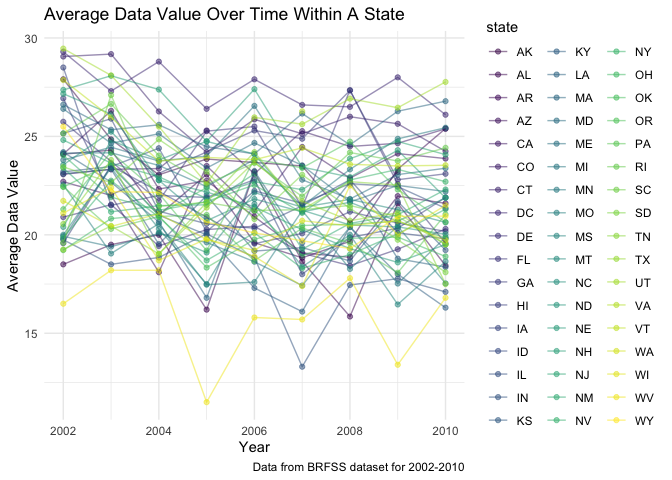
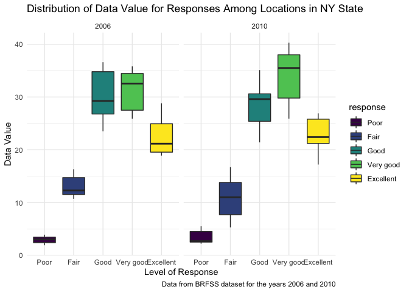
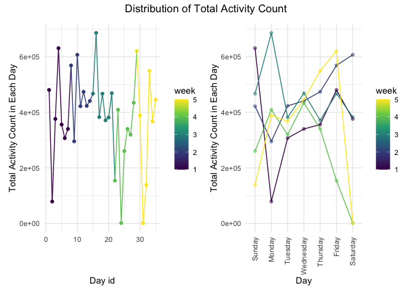

p8105\_hw3\_yc4018
================
Yuxuan Chen

-   Code for setting options of graphs.

``` r
library(tidyverse)
library(patchwork)
library(p8105.datasets)

theme_set(theme_minimal() + theme(legend.position = "right"))

options(
  ggplot2.continuous.colour = "viridis",
  ggplot2.continuous.fill = "viridis"
)

scale_colour_discrete = scale_colour_viridis_d
scale_fill_discrete = scale_fill_viridis_d
```

**Problem 1** load the `instacart` data.

``` r
data("instacart")
```

1.  How many aisles are there, and which aisles are the most items
    ordered from?

``` r
aisle_obs = 
  instacart %>%
  group_by(aisle) %>% 
  summarize(n_obs = n()) %>% 
  arrange(desc(n_obs))

knitr::kable(aisle_obs[0:10,])
```

| aisle                         | n\_obs |
|:------------------------------|-------:|
| fresh vegetables              | 150609 |
| fresh fruits                  | 150473 |
| packaged vegetables fruits    |  78493 |
| yogurt                        |  55240 |
| packaged cheese               |  41699 |
| water seltzer sparkling water |  36617 |
| milk                          |  32644 |
| chips pretzels                |  31269 |
| soy lactosefree               |  26240 |
| bread                         |  23635 |

-   There are 134in the dataset. Since 150609 is the largest
    observations of aisle, fresh vegetables is the aisle that the most
    items ordered from.

2.  Below is a scatter plot that shows the number of items ordered in
    each aisle, which with more than 10000 items ordered.

``` r
aisle_obs %>% 
  filter(n_obs > 10000) %>% 
  mutate(aisle = fct_reorder(aisle, n_obs)) %>% 
  ggplot(aes(x = aisle, y = n_obs)) +
  geom_point() +
  theme(axis.text.x = element_text(angle = 90, hjust = 1, vjust = 0.5)) +
  labs(
    title = "The Number of Items Ordered In Each Aisle",
    x = "Aisle",
    y = "Number of items"
  )
```

<!-- -->

3.  Below table shows the 3 most popular products in each of the aisles
    of “baking ingredients”, “dog food care”, and “packaged vegetables
    fruits”, with the number of times each item is ordered.

``` r
instacart %>% 
  filter(aisle %in% c("baking ingredients", "dog food care","packaged vegetables fruits")) %>%
  group_by(aisle, product_name) %>% 
  summarize(n_times = n()) %>% 
  mutate(
    product_rank = min_rank(desc(n_times)) #rank the items from most popular to least popular
  ) %>% 
  filter(product_rank <= 3) %>% 
  arrange(aisle, product_rank) %>% 
  knitr::kable()
```

| aisle                      | product\_name                                 | n\_times | product\_rank |
|:---------------------------|:----------------------------------------------|---------:|--------------:|
| baking ingredients         | Light Brown Sugar                             |      499 |             1 |
| baking ingredients         | Pure Baking Soda                              |      387 |             2 |
| baking ingredients         | Cane Sugar                                    |      336 |             3 |
| dog food care              | Snack Sticks Chicken & Rice Recipe Dog Treats |       30 |             1 |
| dog food care              | Organix Chicken & Brown Rice Recipe           |       28 |             2 |
| dog food care              | Small Dog Biscuits                            |       26 |             3 |
| packaged vegetables fruits | Organic Baby Spinach                          |     9784 |             1 |
| packaged vegetables fruits | Organic Raspberries                           |     5546 |             2 |
| packaged vegetables fruits | Organic Blueberries                           |     4966 |             3 |

4.  Below table shows the mean hour of the day at which Pink Lady Apples
    and Coffee Ice Cream are ordered on each day of the week.

``` r
instacart %>% 
  filter(product_name %in% c("Pink Lady Apples", "Coffee Ice Cream")) %>% 
  group_by(product_name, order_dow) %>% 
  summarize(mean_hour = mean(order_hour_of_day, na.rm = TRUE)) %>% 
  pivot_wider(
    names_from = "order_dow",
    values_from = "mean_hour"
  ) %>% 
  knitr::kable()
```

| product\_name    |        0 |        1 |        2 |        3 |        4 |        5 |        6 |
|:-----------------|---------:|---------:|---------:|---------:|---------:|---------:|---------:|
| Coffee Ice Cream | 13.77419 | 14.31579 | 15.38095 | 15.31818 | 15.21739 | 12.26316 | 13.83333 |
| Pink Lady Apples | 13.44118 | 11.36000 | 11.70213 | 14.25000 | 11.55172 | 12.78431 | 11.93750 |

5.  **Dataset Interpretation: ** write a short description of the
    dataset, noting the size and structure of the data, describing some
    key variables, and giving illstrative examples of observations.

-   The instacart dataset contains 1384617 observations of 15 variables
    and each row in the dataset is a product from an order, which helps
    to examine the trends in online grocery purchasing. The size of this
    dataset is (1384617, 15). I think the key variables are `aisle`;
    `department`; `product_name`; `add_to_cart_order`, which represents
    the order in which each product was added to cart; `reordered`,
    which shows if this product has been ordered by this user in the
    past; `order_dow`, which shows the day of the week on which the
    order was placed; `order_hour_of_day`,which represents the hour of
    the day on which the order was placed; and `days_since_prior_order`,
    which indicates the days since the last order.

------------------------------------------------------------------------

**Problem 2** load, clean, and tidy the BRFSS data.

``` r
data("brfss_smart2010")

brfss_df = 
  brfss_smart2010 %>% 
  janitor::clean_names() %>% #use appropriate variable names
  filter(topic == "Overall Health") %>%  # focus on Overall Health topic
  separate(locationdesc, into = c("state", "location"), " - ", convert = TRUE) %>%
  select(-locationabbr) %>% 
  filter(response %in% c("Excellent", "Very good", "Good", "Fair", "Poor")) %>%
  mutate(response = factor(response, levels = c("Poor", "Fair", "Good", "Very good", "Excellent")))
```

1.  In 2002, which states were observed at 7 or more locations? What
    about in 2010?

``` r
#In 2002
brfss_2002 = 
  brfss_df %>% 
  filter(year == 2002) %>%
  select(state, location) %>%
  group_by(state) %>% 
  distinct(location, .keep_all = TRUE) %>%
  summarize(n_location = n()) %>% 
  filter(n_location >= 7) 
knitr::kable(brfss_2002)
```

| state | n\_location |
|:------|------------:|
| CT    |           7 |
| FL    |           7 |
| MA    |           8 |
| NC    |           7 |
| NJ    |           8 |
| PA    |          10 |

``` r
#in 2010
brfss_2010 = 
  brfss_df %>% 
  filter(year == 2010) %>%
  select(state, location) %>%
  group_by(state) %>% 
  distinct(location, .keep_all = TRUE) %>%
  summarize(n_location = n()) %>% 
  filter(n_location >= 7) 
knitr::kable(brfss_2010)
```

| state | n\_location |
|:------|------------:|
| CA    |          12 |
| CO    |           7 |
| FL    |          41 |
| MA    |           9 |
| MD    |          12 |
| NC    |          12 |
| NE    |          10 |
| NJ    |          19 |
| NY    |           9 |
| OH    |           8 |
| PA    |           7 |
| SC    |           7 |
| TX    |          16 |
| WA    |          10 |

-   The above datasets show the states that were observed at 7 or more
    locations in 2002 and 2010. Hence, in 2002, CT, FL, MA, NC, NJ, PA
    are the states that were observed at 7 or more locations. And in
    2010, CA, CO, FL, MA, MD, NC, NE, NJ, NY, OH, PA, SC, TX, WA are the
    states that were observed at 7 or more locations.

2.  1)Below is the dataset that is limited to `Excellent` responses, and
    contains year, state, and the averages of the `data_value` across
    locations within a state.

``` r
brfss_excellent = 
  brfss_df %>% 
  filter(response == "Excellent") %>% 
  group_by(year, state) %>% 
  summarize(
    mean = mean(data_value, na.rm = TRUE)
  )  
knitr::kable(brfss_excellent[0:5,]) 
```

| year | state | mean |
|-----:|:------|-----:|
| 2002 | AK    | 27.9 |
| 2002 | AL    | 18.5 |
| 2002 | AR    | 24.1 |
| 2002 | AZ    | 24.1 |
| 2002 | CA    | 22.7 |

2)Below is the “spaghetti” plot of the averages of the `data_value` over
time within a state.

``` r
brfss_excellent %>% 
  ggplot(aes(x = year, y = mean, color = state)) + 
  geom_point(alpha = .5) + 
  geom_line(alpha = .5) +
  labs(
    title = "Average Data Value Over Time Within A State",
    x = "Year",
    y = "Average Data Value",
    caption = "Data from BRFSS dataset for 2002-2010"
  ) 
```

<!-- -->

3.  Below is the two-panel plot showing the distribution of data value
    for responses (“Poor” to “Excellent”) among locations in NY State
    for the years 2006 and 2010.

``` r
brfss_df %>% 
  filter(
    year == 2006 | year == 2010,
    state == "NY"
  ) %>% 
  ggplot(aes(x = response, y = data_value, fill = response)) + 
  geom_boxplot() +
  facet_grid(. ~ year) + 
  labs(
    title = "Distribution of Data Value for Responses Among Locations in NY State",
    x = "Level of Response",
    y = "Data Value",
    caption = "Data from BRFSS dataset for the years 2006 and 2010"
  ) 
```

<!-- --> -
\*\*interpretation!

wide range 4. **Dataset Interpretation:** - After loading, cleaning, and
tidying the BRFSS data, I have a resulting dataset named `brfss_df`
dataset. The `brfss_df` dataset is from the Behavioral Risk Factors
Surveillance System for Selected Metropolitan Area Risk Trends (SMART)
for 2002-2010, which contains 10625 observations of 23 variables. The
dimension of this dataset is (10625, 23). I think the key variables are:
year, state, location, class, topic, question, and response.

------------------------------------------------------------------------

**Problem 3**

1.  Load and tidy the accelerometer data.

``` r
accel_df = read_csv("./data/accel_data.csv")

accel_df = 
  accel_df %>% 
  janitor::clean_names() %>% 
  pivot_longer(
    activity_1:activity_1440,
    names_to = "minute_in_a_day",
    names_prefix = "activity.", #exclude the `activity.` prefix in each case
    values_to = "activity_count"
  ) %>% 
  mutate(
    type_of_day = if_else( day %in% c("Saturday", "Sunday" ), "weekend", "weekday"),
    minute_in_a_day = as.numeric(minute_in_a_day),
    ####day_id = as.numeric(day_id),
    day = factor(day, levels = c("Sunday", "Monday", "Tuesday", "Wednesday", "Thursday", "Friday", "Saturday")),
    ) %>% 
  relocate(week, day_id, day, type_of_day)
```

-   After loading, cleaning, and tidying the accelerometer data, I have
    a resulting dataset named `accel_df` dataset. The `accel_df` dataset
    is a five weeks of accelerometer data collected on a 63 year-old
    male with BMI 25, who was admitted to the Advanced Cardiac Care
    Center of Columbia University Medical Center and diagnosed with
    congestive heart failure (CHF). This dataset contains 50400
    observations with 6 variables. The dimension of this dataset is
    (50400, 6). The variables included in this dataset are `week`,
    `day_id`, `day`, `minute_in_a_day`, `activity_count`, and
    `type_of_day`. The variable `week` shows the number of week;
    variable `day_id` indicates the unique number of each day; variable
    `day` indicates the day of the week; variable `minute_in_a_day`
    indicates the number of minute of a 24-hour day starting at
    midnight; variable `activity_count` indicates activity counts for
    each minute; and variable `type_of_day` indicates this day is a
    weekday or weekend.

2.  Below is the table of the total activity count for each day.

``` r
total_activity_df = 
  accel_df %>% 
  group_by(week, day_id, day) %>% 
  summarize(
    total_activity_count = sum(activity_count)
  ) 
```

    ## `summarise()` has grouped output by 'week', 'day_id'. You can override using the `.groups` argument.

``` r
knitr::kable(total_activity_df)
```

| week | day\_id | day       | total\_activity\_count |
|-----:|--------:|:----------|-----------------------:|
|    1 |       1 | Friday    |              480542.62 |
|    1 |       2 | Monday    |               78828.07 |
|    1 |       3 | Saturday  |              376254.00 |
|    1 |       4 | Sunday    |              631105.00 |
|    1 |       5 | Thursday  |              355923.64 |
|    1 |       6 | Tuesday   |              307094.24 |
|    1 |       7 | Wednesday |              340115.01 |
|    2 |       8 | Friday    |              568839.00 |
|    2 |       9 | Monday    |              295431.00 |
|    2 |      10 | Saturday  |              607175.00 |
|    2 |      11 | Sunday    |              422018.00 |
|    2 |      12 | Thursday  |              474048.00 |
|    2 |      13 | Tuesday   |              423245.00 |
|    2 |      14 | Wednesday |              440962.00 |
|    3 |      15 | Friday    |              467420.00 |
|    3 |      16 | Monday    |              685910.00 |
|    3 |      17 | Saturday  |              382928.00 |
|    3 |      18 | Sunday    |              467052.00 |
|    3 |      19 | Thursday  |              371230.00 |
|    3 |      20 | Tuesday   |              381507.00 |
|    3 |      21 | Wednesday |              468869.00 |
|    4 |      22 | Friday    |              154049.00 |
|    4 |      23 | Monday    |              409450.00 |
|    4 |      24 | Saturday  |                1440.00 |
|    4 |      25 | Sunday    |              260617.00 |
|    4 |      26 | Thursday  |              340291.00 |
|    4 |      27 | Tuesday   |              319568.00 |
|    4 |      28 | Wednesday |              434460.00 |
|    5 |      29 | Friday    |              620860.00 |
|    5 |      30 | Monday    |              389080.00 |
|    5 |      31 | Saturday  |                1440.00 |
|    5 |      32 | Sunday    |              138421.00 |
|    5 |      33 | Thursday  |              549658.00 |
|    5 |      34 | Tuesday   |              367824.00 |
|    5 |      35 | Wednesday |              445366.00 |

``` r
gg_day_activity = 
  total_activity_df %>% 
  ggplot(aes(x = day, y = total_activity_count, group = week, color = week)) + 
  geom_point(alpha = .5) +
  geom_line() +
  theme(axis.text.x = element_text(angle = 90, hjust = 1, vjust = 0.5)) +
  labs(
    #title = "Distribution of Total Activity Count in Each Day Per Week",
    x = "Day",
    y = "Total Activity Count in Each Day",
  ) 

gg_dayid_activity = 
  total_activity_df %>% 
  ggplot(aes(x = day_id, y = total_activity_count, color = week)) + 
  geom_point() +
  geom_line() +
  labs(
    #title = "Distribution of Total Activity Count in Each Day",
    x = "Day id",
    y = "Total Activity Count in Each Day",
  ) 

(gg_dayid_activity + gg_day_activity) + 
  plot_annotation(title = "Distribution of Total Activity Count") & 
  theme(plot.title = element_text(hjust = 0.5))
```

<!-- -->

-   Since traditional analyses of accelerometer data focus on the total
    activity over the day, I drew two plots above. The left plot simply
    shows the distribution of total activity count in each day; and on
    the right plot, I grouped the day by week, and the plot shows the
    distribution of total activity count in each day based on week for 5
    weeks.
-   Based on two plots above, the total activity count fluctuates and
    oscillates up and down, but roughly spread around 3.5\*10^5 counts
    for each day. In first 2 weeks, total activity count on Monday is
    lower than that on Friday; but in the rest of three weeks, total
    activity count on Monday has larger value than on Friday. The total
    activity count always increasing from Tuesday to Wednesday. Saturday
    has high total activity count for first three weeks, but become 0 on
    the last two weeks.
