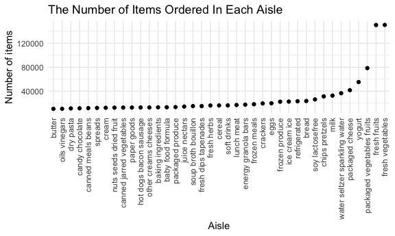

p8105\_hw3\_yc4018
================
Yuxuan Chen

``` r
library(tidyverse)
library(p8105.datasets)

knitr::opts_chunk$set(
  fig.width = 6,
  fig.asp = .6,
  out.width = "90%"
)

theme_set(theme_minimal() + theme(legend.position = "bottom"))

options(
  ggplot2.continuous.colour = "viridis",
  ggplot2.continuous.fill = "viridis"
)

scale_colour_discrete = scale_colour_viridis_d
scale_fill_discrete = scale_fill_viridis_d
```

-   Above code is for setting options of graphs

**Problem 1**

``` r
data("instacart")
```

1.  How many aisles are there, and which aisles are the most items
    ordered from?

``` r
aisle_obs = 
  instacart %>%
  group_by(aisle) %>% 
  summarize(n_obs = n()) %>% 
  arrange(desc(n_obs))

knitr::kable(aisle_obs[0:10,])
```

| aisle                         | n\_obs |
|:------------------------------|-------:|
| fresh vegetables              | 150609 |
| fresh fruits                  | 150473 |
| packaged vegetables fruits    |  78493 |
| yogurt                        |  55240 |
| packaged cheese               |  41699 |
| water seltzer sparkling water |  36617 |
| milk                          |  32644 |
| chips pretzels                |  31269 |
| soy lactosefree               |  26240 |
| bread                         |  23635 |

-   There are 134in the dataset. Since 150609 is the largest
    observations of aisle, fresh vegetables is the aisle that the most
    items ordered from.

2.  Below is a scatter plot that shows the number of items ordered in
    each aisle, which with more than 10000 items ordered.

``` r
aisle_obs %>% 
  filter(n_obs > 10000) %>% 
  mutate(aisle = fct_reorder(aisle, n_obs)) %>% 
  ggplot(aes(x = aisle, y = n_obs)) +
  geom_point() +
  theme(axis.text.x = element_text(angle = 90, hjust = 1, vjust = 0.5)) +
  labs(
    title = "The Number of Items Ordered In Each Aisle",
    x = "Aisle",
    y = "Number of items"
  )
```



3.  Below table shows the 3 most popular products in each of the aisles
    of “baking ingredients”, “dog food care”, and “packaged vegetables
    fruits”, with the number of times each item is ordered.

``` r
instacart %>% 
  filter(aisle %in% c("baking ingredients", "dog food care","packaged vegetables fruits")) %>%
  group_by(aisle, product_name) %>% 
  summarize(n_times = n()) %>% 
  mutate(
    product_rank = min_rank(desc(n_times)) #rank the items from most popular to least popular
  ) %>% 
  filter(product_rank <= 3) %>% 
  arrange(aisle, product_rank) %>% 
  knitr::kable()
```

    ## `summarise()` has grouped output by 'aisle'. You can override using the `.groups` argument.

| aisle                      | product\_name                                 | n\_times | product\_rank |
|:---------------------------|:----------------------------------------------|---------:|--------------:|
| baking ingredients         | Light Brown Sugar                             |      499 |             1 |
| baking ingredients         | Pure Baking Soda                              |      387 |             2 |
| baking ingredients         | Cane Sugar                                    |      336 |             3 |
| dog food care              | Snack Sticks Chicken & Rice Recipe Dog Treats |       30 |             1 |
| dog food care              | Organix Chicken & Brown Rice Recipe           |       28 |             2 |
| dog food care              | Small Dog Biscuits                            |       26 |             3 |
| packaged vegetables fruits | Organic Baby Spinach                          |     9784 |             1 |
| packaged vegetables fruits | Organic Raspberries                           |     5546 |             2 |
| packaged vegetables fruits | Organic Blueberries                           |     4966 |             3 |
