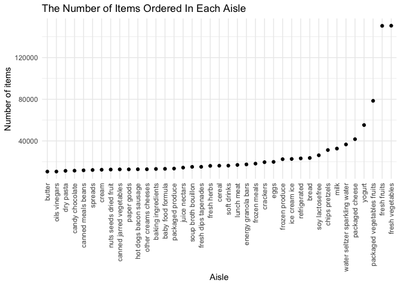
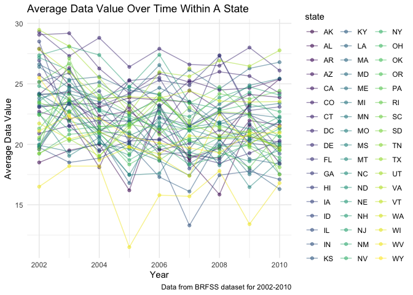

p8105\_hw3\_yc4018
================
Yuxuan Chen

-   Code for setting options of graphs.

``` r
library(tidyverse)
library(p8105.datasets)

theme_set(theme_minimal() + theme(legend.position = "right"))

options(
  ggplot2.continuous.colour = "viridis",
  ggplot2.continuous.fill = "viridis"
)

scale_colour_discrete = scale_colour_viridis_d
scale_fill_discrete = scale_fill_viridis_d
```

**Problem 1** load the `instacart` data.

``` r
data("instacart")
```

1.  How many aisles are there, and which aisles are the most items
    ordered from?

``` r
aisle_obs = 
  instacart %>%
  group_by(aisle) %>% 
  summarize(n_obs = n()) %>% 
  arrange(desc(n_obs))

knitr::kable(aisle_obs[0:10,])
```

| aisle                         | n\_obs |
|:------------------------------|-------:|
| fresh vegetables              | 150609 |
| fresh fruits                  | 150473 |
| packaged vegetables fruits    |  78493 |
| yogurt                        |  55240 |
| packaged cheese               |  41699 |
| water seltzer sparkling water |  36617 |
| milk                          |  32644 |
| chips pretzels                |  31269 |
| soy lactosefree               |  26240 |
| bread                         |  23635 |

-   There are 134in the dataset. Since 150609 is the largest
    observations of aisle, fresh vegetables is the aisle that the most
    items ordered from.

2.  Below is a scatter plot that shows the number of items ordered in
    each aisle, which with more than 10000 items ordered.

``` r
aisle_obs %>% 
  filter(n_obs > 10000) %>% 
  mutate(aisle = fct_reorder(aisle, n_obs)) %>% 
  ggplot(aes(x = aisle, y = n_obs)) +
  geom_point() +
  theme(axis.text.x = element_text(angle = 90, hjust = 1, vjust = 0.5)) +
  labs(
    title = "The Number of Items Ordered In Each Aisle",
    x = "Aisle",
    y = "Number of items"
  )
```

<!-- -->

3.  Below table shows the 3 most popular products in each of the aisles
    of “baking ingredients”, “dog food care”, and “packaged vegetables
    fruits”, with the number of times each item is ordered.

``` r
instacart %>% 
  filter(aisle %in% c("baking ingredients", "dog food care","packaged vegetables fruits")) %>%
  group_by(aisle, product_name) %>% 
  summarize(n_times = n()) %>% 
  mutate(
    product_rank = min_rank(desc(n_times)) #rank the items from most popular to least popular
  ) %>% 
  filter(product_rank <= 3) %>% 
  arrange(aisle, product_rank) %>% 
  knitr::kable()
```

| aisle                      | product\_name                                 | n\_times | product\_rank |
|:---------------------------|:----------------------------------------------|---------:|--------------:|
| baking ingredients         | Light Brown Sugar                             |      499 |             1 |
| baking ingredients         | Pure Baking Soda                              |      387 |             2 |
| baking ingredients         | Cane Sugar                                    |      336 |             3 |
| dog food care              | Snack Sticks Chicken & Rice Recipe Dog Treats |       30 |             1 |
| dog food care              | Organix Chicken & Brown Rice Recipe           |       28 |             2 |
| dog food care              | Small Dog Biscuits                            |       26 |             3 |
| packaged vegetables fruits | Organic Baby Spinach                          |     9784 |             1 |
| packaged vegetables fruits | Organic Raspberries                           |     5546 |             2 |
| packaged vegetables fruits | Organic Blueberries                           |     4966 |             3 |

4.  Below table shows the mean hour of the day at which Pink Lady Apples
    and Coffee Ice Cream are ordered on each day of the week.

``` r
instacart %>% 
  filter(product_name %in% c("Pink Lady Apples", "Coffee Ice Cream")) %>% 
  group_by(product_name, order_dow) %>% 
  summarize(mean_hour = mean(order_hour_of_day, na.rm = TRUE)) %>% 
  pivot_wider(
    names_from = "order_dow",
    values_from = "mean_hour"
  ) %>% 
  knitr::kable()
```

| product\_name    |        0 |        1 |        2 |        3 |        4 |        5 |        6 |
|:-----------------|---------:|---------:|---------:|---------:|---------:|---------:|---------:|
| Coffee Ice Cream | 13.77419 | 14.31579 | 15.38095 | 15.31818 | 15.21739 | 12.26316 | 13.83333 |
| Pink Lady Apples | 13.44118 | 11.36000 | 11.70213 | 14.25000 | 11.55172 | 12.78431 | 11.93750 |

5.  **Dataset Interpretation: ** write a short description of the
    dataset, noting the size and structure of the data, describing some
    key variables, and giving illstrative examples of observations.

-   The instacart dataset contains 1384617 observations of 15 variables
    and each row in the dataset is a product from an order, which helps
    to examine the trends in online grocery purchasing. The size of this
    dataset is (1384617, 15). I think the key variables are `aisle`;
    `department`; `product_name`; `add_to_cart_order`, which represents
    the order in which each product was added to cart; `reordered`,
    which shows if this product has been ordered by this user in the
    past; `order_dow`, which shows the day of the week on which the
    order was placed; `order_hour_of_day`,which represents the hour of
    the day on which the order was placed; and `days_since_prior_order`,
    which indicates the days since the last order.

------------------------------------------------------------------------

**Problem 2** load, clean, and tidy the BRFSS data.

``` r
data("brfss_smart2010")

brfss_df = 
  brfss_smart2010 %>% 
  janitor::clean_names() %>% #use appropriate variable names
  filter(topic == "Overall Health") %>%  # focus on Overall Health topic
  separate(locationdesc, into = c("state", "location"), "-", convert = TRUE) %>%
  select(-locationabbr) %>% 
  filter(response %in% c("Excellent", "Very good", "Good", "Fair", "Poor")) %>%
  mutate(response = factor(response, levels = c("Poor", "Fair", "Good", "Very good", "Excellent"))) %>% view
```

1.  In 2002, which states were observed at 7 or more locations? What
    about in 2010?

``` r
#In 2002
brfss_2002 = 
  brfss_df %>% 
  filter(year == 2002) %>%
  select(state, location) %>%
  group_by(state) %>% 
  distinct(location, .keep_all = TRUE) %>%
  summarize(n_location = n()) %>% 
  filter(n_location >= 7) 
knitr::kable(brfss_2002)
```

| state | n\_location |
|:------|------------:|
| CT    |           7 |
| FL    |           7 |
| MA    |           8 |
| NC    |           7 |
| NJ    |           8 |
| PA    |          10 |

``` r
#in 2010
brfss_2010 = 
  brfss_df %>% 
  filter(year == 2010) %>%
  select(state, location) %>%
  group_by(state) %>% 
  distinct(location, .keep_all = TRUE) %>%
  summarize(n_location = n()) %>% 
  filter(n_location >= 7) 
knitr::kable(brfss_2010)
```

| state | n\_location |
|:------|------------:|
| CA    |          12 |
| CO    |           7 |
| FL    |          41 |
| MA    |           9 |
| MD    |          12 |
| NC    |          12 |
| NE    |          10 |
| NJ    |          19 |
| NY    |           9 |
| OH    |           8 |
| PA    |           7 |
| SC    |           7 |
| TX    |          16 |
| WA    |          10 |

-   The above datasets show the states that were observed at 7 or more
    locations in 2002 and 2010. Hence, in 2002, CT, FL, MA, NC, NJ, PA
    are the states that were observed at 7 or more locations. And in
    2010, CA, CO, FL, MA, MD, NC, NE, NJ, NY, OH, PA, SC, TX, WA are the
    states that were observed at 7 or more locations.

2.  1.  Below is the dataset that is limited to `Excellent` responses,
        and contains year, state, and the averages of the `data_value`
        across locations within a state.

``` r
brfss_excellent = 
  brfss_df %>% 
  filter(response == "Excellent") %>% 
  group_by(year, state) %>% 
  summarize(
    mean = mean(data_value, na.rm = TRUE)
  )  
knitr::kable(brfss_excellent[0:5,]) 
```

| year | state | mean |
|-----:|:------|-----:|
| 2002 | AK    | 27.9 |
| 2002 | AL    | 18.5 |
| 2002 | AR    | 24.1 |
| 2002 | AZ    | 24.1 |
| 2002 | CA    | 22.7 |

2.  Below is the “spaghetti” plot of the averages of the `data_value`
    over time within a state.

``` r
brfss_excellent %>% 
  ggplot(aes(x = year, y = mean, color = state)) + 
  geom_point(alpha = .5) + 
  geom_line(alpha = .5) +
  labs(
    title = "Average Data Value Over Time Within A State",
    x = "Year",
    y = "Average Data Value",
    caption = "Data from BRFSS dataset for 2002-2010"
  ) 
```

<!-- -->
